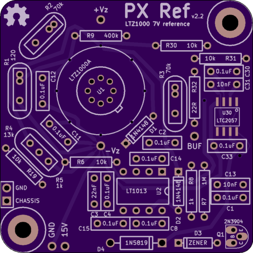

# PX Ref

This is an LTZ1000-based 7V reference.

Specifically, this is my board layout of a circuit [published](http://www.eevblog.com/forum/metrology/ultra-precision-reference-ltz1000/msg249123/#msg249123) by Andreas (of the EEVBlog forum), which in turn is a modification of the 7V reference circuit from the [datasheet](http://cds.linear.com/docs/en/datasheet/1000afe.pdf).

You can order a copy of this board from OSHPark: [link](https://oshpark.com/shared_projects/etqxI0Ok)

Andreas' original schematic: [png](media/LTZ1KA_1b.PNG)

My adapted version of Andreas' schematic: [pdf](kicad/releases/v2.2/basic-ltz1000.pdf)

My post to the EEVBlog forum about this design: [link](http://www.eevblog.com/forum/metrology/ultra-precision-reference-ltz1000/msg1375209/#msg1375209)

The naming of this board was inspired by other LTZ1000 references: [KX](https://xdevs.com/article/kx-ref/), [FX](https://xdevs.com/article/792x/), [MX](https://www.eevblog.com/forum/metrology/mx-reference/), [CX](https://www.eevblog.com/forum/metrology/cx-reference/)

See also: https://github.com/pepaslabs/dr-frank-ltz1000
